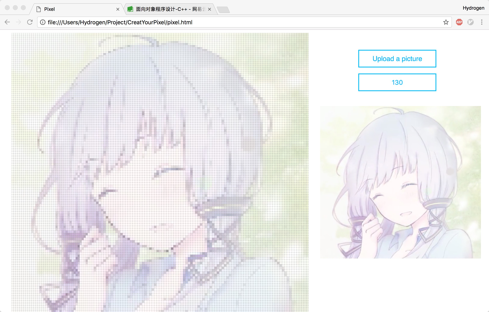
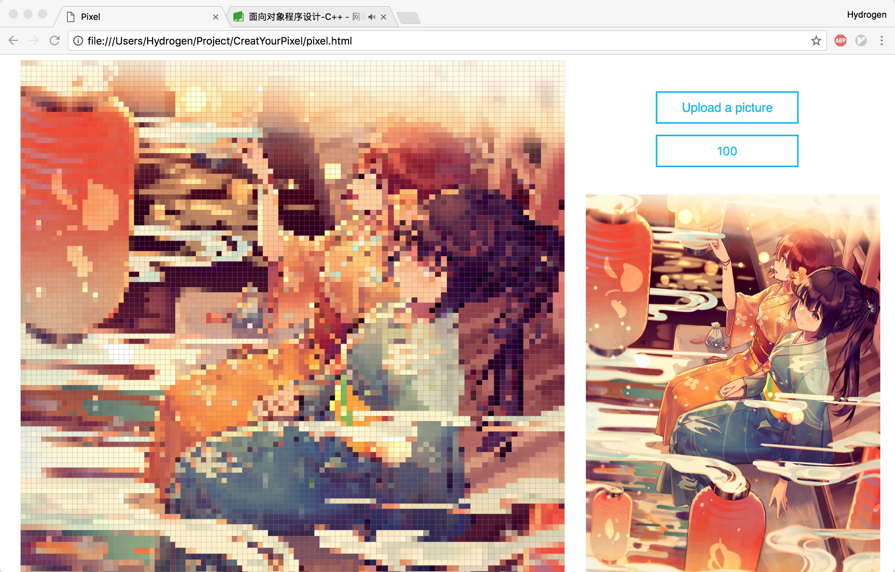

# Create Your Own Pixel Style Picture

### Preview

### How to use

Download and open __pixel.html__.

### Notice

If the __col__ is less than 50, there are some animations.

If the __col__ is setting more than 130, the pixel style table may be incomplete.

### Completment

You can use `FileReader()` in html5 and `drawImage()` in canvas.